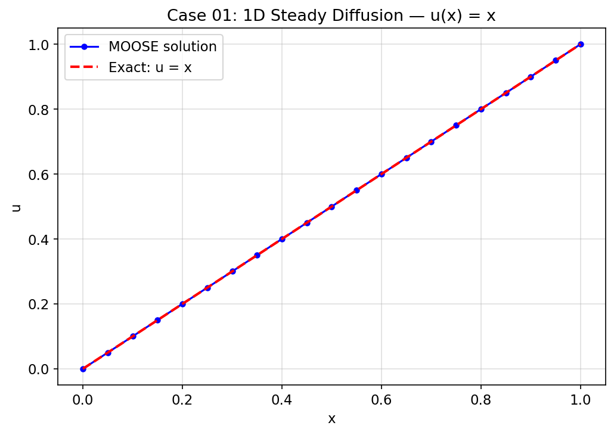
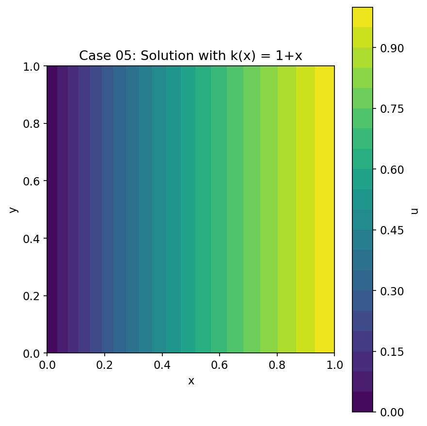
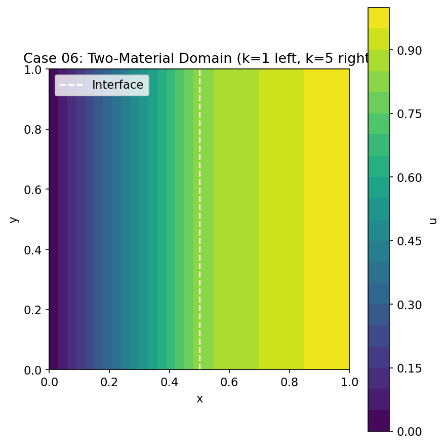
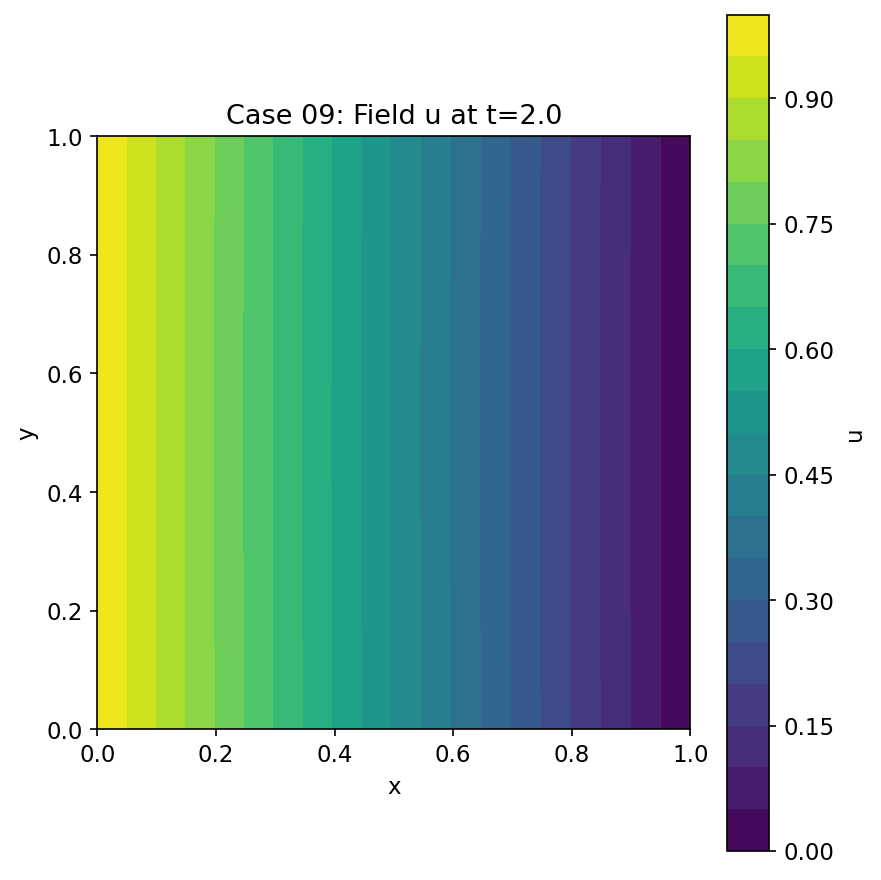
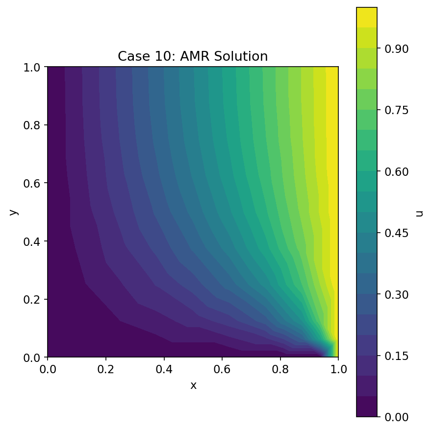
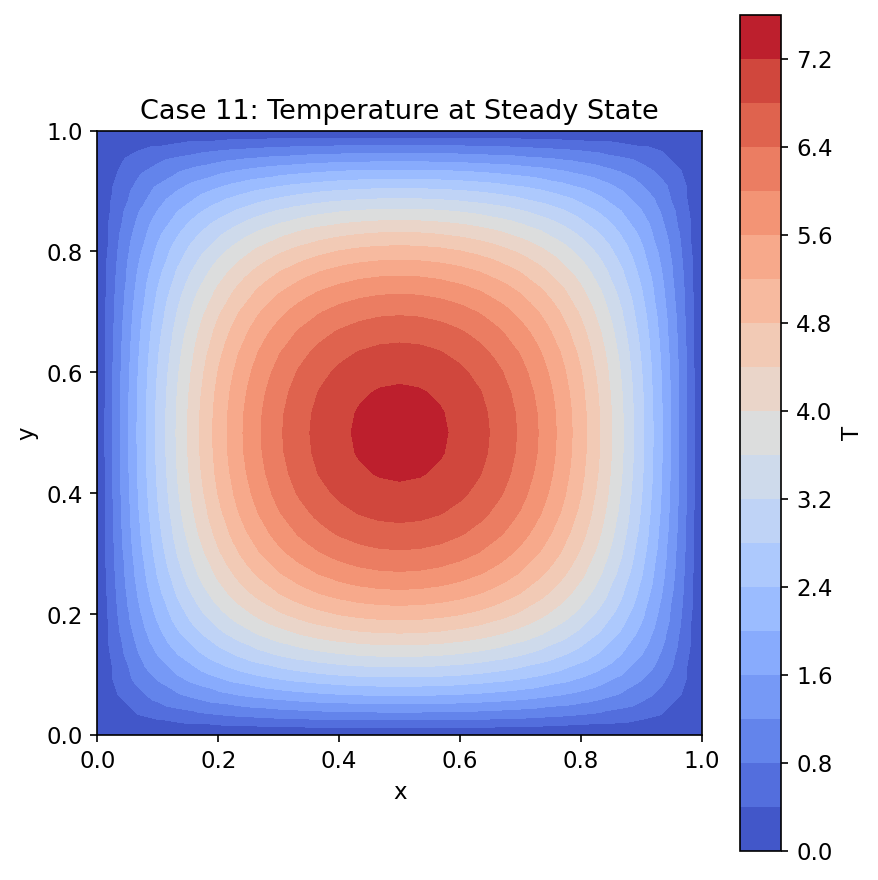
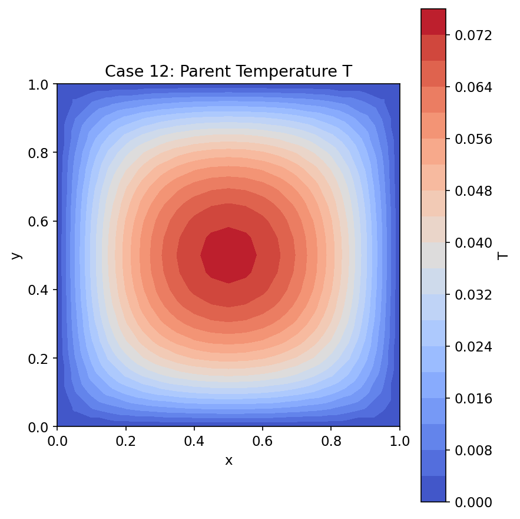

# MOOSE — Multiphysics Object-Oriented Simulation Environment

> **This repository is based on the original [MOOSE framework by Idaho National Laboratory](https://github.com/idaholab/moose).**
>
> This repo **does not include the MOOSE source codes**. Instead, it supplements the original
> repository with **comprehensive documentation and worked examples** designed to help new users
> learn the framework from scratch. The 13 progressive quickstart cases are fully explained — from
> the physics and governing equations, through the input file structure, to interpreting the
> simulation results — so that users can learn how to set up their own simulations and understand
> the output without any external help.
>
> **Original repository:** https://github.com/idaholab/moose
> **Official documentation:** https://mooseframework.inl.gov

---

[](LICENSE)

MOOSE is an open-source, parallel finite-element multiphysics framework developed and maintained
by [Idaho National Laboratory](https://www.inl.gov). It provides a high-level C++ API built on
top of [PETSc](https://petsc.org) (nonlinear solvers) and [libMesh](https://libmesh.github.io)
(finite-element discretization), enabling scientists and engineers to write tightly-coupled
multiphysics simulation codes without having to manage the underlying numerical infrastructure
themselves.

## What is MOOSE?

MOOSE was created to lower the barrier to developing rigorous, production-quality simulation
codes. Rather than forcing every research group to re-implement parallel mesh management,
nonlinear solver interfaces, and input-file parsing, MOOSE provides these as a reusable
foundation. A developer who wants to add a new physical model writes a single C++ class — a
`Kernel`, `BoundaryCondition`, or `Material` — that contributes the weak-form residual for one
equation. The framework handles assembly, Jacobian computation (analytically via automatic
differentiation, or by finite difference), load balancing, and parallel I/O.

The framework is designed around full coupling. All physics share the same nonlinear solve, so
there is no operator splitting unless you explicitly request it. This makes MOOSE especially
well-suited to problems where multiphysics feedback is strong: nuclear fuel performance, reactor
thermal-hydraulics, geological carbon storage, metal additive manufacturing, and similar
coupled-field applications. The same code that runs on a laptop with 4 cores can be submitted
unchanged to a leadership-class supercomputer; the largest MOOSE runs have exceeded
**100,000 CPU cores**.

MOOSE is used by dozens of national laboratories, universities, and industrial organizations
worldwide. Idaho National Laboratory's own suite of application codes — BISON (nuclear fuel),
RELAP-7 (system thermal-hydraulics), Grizzly (reactor structural aging), and others — are all
built on MOOSE. The framework is released under the GNU Lesser General Public License 2.1,
making it freely available for both academic and commercial derivative applications.

The repository is organized into three tiers: the **framework** (core kernel, always required),
optional **modules** (reusable physics packages), and **applications** (end-user codes that
combine a framework build with one or more modules). This layered design means that work done in
a module — a new contact algorithm, a new equation of state, a new solver strategy — is
immediately available to every application that enables that module.

---

## Key Capabilities

| Feature | Description |
|---|---|
| Fully-coupled, fully-implicit multiphysics | All field equations are assembled into a single nonlinear system and solved simultaneously via Newton's method with PETSc back-ends |
| FEM, FVM, and DG methods | Continuous Galerkin FEM, cell-centered finite volume, and discontinuous Galerkin (including mixed DG/FEM in the same simulation) |
| Parallel execution (MPI + threading) | Domain-decomposed MPI parallelism with optional threaded assembly; runs from a laptop to >100 K cores without code changes |
| Automatic mesh adaptivity | h-refinement and coarsening driven by error estimators or custom indicators; fully parallel with dynamic load balancing |
| Automatic differentiation (AD) | AD-generated exact Jacobians via dual-number arithmetic; eliminates hand-coded Jacobian maintenance |
| MultiApp multiscale coupling | Hierarchical sub-application trees with flexible data transfers, enabling macro/micro or system/component coupling |
| 25+ physics modules | Heat transfer, solid mechanics, Navier-Stokes, porous flow, phase field, contact, XFEM, ray tracing, stochastic tools, and more |
| Python tooling | TestHarness (parallel test runner), MooseDocs (documentation), pyhit (input-file parsing), mooseutils, Peacock GUI, Chigger visualization |

---

## What This Repository Provides

This repository focuses on **learning materials** for the MOOSE framework:

- **Comprehensive documentation** covering architecture, developer workflows, input-file syntax, and all 29 physics modules
- **13 progressive quickstart examples** (`quickstart-runs/`) — each with a complete input file, detailed README explaining the physics, and matplotlib visualization of the results
- **An 8-week study plan** for self-learners going from zero to productive MOOSE developer
- **Docker instructions** for running MOOSE on Windows without compiling from source

To actually build and run MOOSE simulations, you need the framework itself from the [original repository](https://github.com/idaholab/moose) or the official [Docker image](https://hub.docker.com/r/idaholab/moose) (`idaholab/moose:latest`).

---

## Documentation

| File | Description |
|---|---|
| [docs/architecture.md](docs/architecture.md) | System architecture with subsystem diagrams covering the Framework → Modules → Applications hierarchy |
| [docs/developer-guide.md](docs/developer-guide.md) | Step-by-step C++ developer tutorial: writing Kernels, BCs, Materials, and custom objects |
| [docs/user-guide.md](docs/user-guide.md) | Simulation user reference covering input-file syntax, all major blocks, and solver options |
| [docs/quick-start.md](docs/quick-start.md) | 13 worked examples progressing from simple diffusion through transient multiphysics |
| [docs/zero-to-hero.md](docs/zero-to-hero.md) | 8-week structured study plan for new MOOSE developers |
| [docs/modules-reference.md](docs/modules-reference.md) | Physics module reference with API summaries and example input files |
| [docs/docker-guide.md](docs/docker-guide.md) | Running MOOSE on Windows with Docker — installation, volume mounts, MPI |

The official online documentation lives at **https://mooseframework.inl.gov**.

---

## Quickstart Examples

The `quickstart-runs/` directory contains 13 fully worked examples, each in its own subdirectory with:

- **Input file** (`.i`) — ready to run with `moose_test-opt` or `combined-opt`
- **Detailed README** — explains the physics, walks through every input-file block, describes the output files, and shows how to interpret the results
- **Visualization plots** (`.png`) — matplotlib-generated 2D/3D plots of the simulation output

<table>
<tr>
<td align="center" width="25%">
<a href="quickstart-runs/case01-1d-steady-diffusion"></a><br/>
<b>Case 01</b>: 1D Steady Diffusion
</td>
<td align="center" width="25%">
<a href="quickstart-runs/case02-2d-steady-diffusion"></a><br/>
<b>Case 02</b>: 2D Steady Diffusion
</td>
<td align="center" width="25%">
<a href="quickstart-runs/case03-transient-heat"></a><br/>
<b>Case 03</b>: Transient Heat
</td>
<td align="center" width="25%">
<a href="quickstart-runs/case04-manufactured-solution"></a><br/>
<b>Case 04</b>: Manufactured Solution
</td>
</tr>
<tr>
<td align="center">
<a href="quickstart-runs/case05-neumann-bc"></a><br/>
<b>Case 05</b>: Neumann BC
</td>
<td align="center">
<a href="quickstart-runs/case06-two-material-domain"></a><br/>
<b>Case 06</b>: Two-Material Domain
</td>
<td align="center">
<a href="quickstart-runs/case07-nonlinear-diffusion"></a><br/>
<b>Case 07</b>: Nonlinear Diffusion
</td>
<td align="center">
<a href="quickstart-runs/case08-advection-diffusion"></a><br/>
<b>Case 08</b>: Advection-Diffusion
</td>
</tr>
<tr>
<td align="center">
<a href="quickstart-runs/case09-coupled-reaction-diffusion"></a><br/>
<b>Case 09</b>: Coupled Reaction-Diffusion
</td>
<td align="center">
<a href="quickstart-runs/case10-adaptive-mesh-refinement"></a><br/>
<b>Case 10</b>: Adaptive Mesh Refinement
</td>
<td align="center">
<a href="quickstart-runs/case11-adaptive-timestepping"></a><br/>
<b>Case 11</b>: Adaptive Timestepping
</td>
<td align="center">
<a href="quickstart-runs/case12-multiapp-coupling"></a><br/>
<b>Case 12</b>: MultiApp Coupling
</td>
</tr>
<tr>
<td align="center">
<a href="quickstart-runs/case13-custom-kernel"></a><br/>
<b>Case 13</b>: Custom Kernel
</td>
<td align="center" colspan="3">
<i>Each case includes a detailed README with physics explanations, input file walkthrough, and plot interpretation guide.</i>
</td>
</tr>
</table>

See [quickstart-runs/README.md](quickstart-runs/README.md) for a comprehensive overview.

---

## Quick Install

Prerequisites: C++17 compiler, MPI, Python 3.x. The recommended path is via the
[MOOSE conda environment](https://mooseframework.inl.gov/getting_started/installation/conda.html)
which provides PETSc and libMesh pre-built.

```bash
# 1. Clone the repository
git clone https://github.com/idaholab/moose.git
cd moose

# 2. (Optional) configure optional dependencies
./configure --with-derivative-size=64

# 3. Build the framework library
cd framework && make -j8

# 4. Build and run the framework test application
cd ../test && make -j8
./run_tests -j8 --re=simple_diffusion
```

A passing `simple_diffusion` test confirms your build is functional. Full installation
instructions, including HPC module setups and Docker/Apptainer images, are at
https://mooseframework.inl.gov/getting_started/installation.

---

## Your First Simulation

The canonical first simulation solves the Poisson equation on a 2-D unit square mesh with
Dirichlet boundary conditions: `u = 0` on the left edge and `u = 1` on the right edge.

Save the following as `simple_diffusion.i`:

```
[Mesh]
  type = GeneratedMesh
  dim = 2
  nx = 10
  ny = 10
[]

[Variables]
  [u]
  []
[]

[Kernels]
  [diff]
    type = Diffusion
    variable = u
  []
[]

[BCs]
  [left]
    type = DirichletBC
    variable = u
    boundary = left
    value = 0
  []
  [right]
    type = DirichletBC
    variable = u
    boundary = right
    value = 1
  []
[]

[Executioner]
  type = Steady
  solve_type = 'PJFNK'
  petsc_options_iname = '-pc_type'
  petsc_options_value = 'hypre'
[]

[Outputs]
  exodus = true
[]
```

Run it with the test application binary:

```bash
cd test
./moose_test-opt -i simple_diffusion.i
```

MOOSE will print a convergence table to the console and write `simple_diffusion_out.e`, an
Exodus II file you can open in [ParaView](https://www.paraview.org) or
[VisIt](https://visit-dav.github.io/visit-website/). You should see the solution converge in
one Newton iteration (the problem is linear), finishing in well under a second.

---

## Building

MOOSE uses GNU Make. The `METHOD` variable selects the build type:

| Command | Description |
|---|---|
| `cd framework && make -j8` | Build the core framework library (`libmoose`) in optimized mode |
| `METHOD=dbg make -j8` | Debug build with assertions and symbol information |
| `METHOD=devel make -j8` | Development build — optimized but with extra runtime checks |
| `cd test && make -j8` | Build the framework test application |
| `cd modules/heat_transfer && make -j8` | Build a single physics module |
| `cd modules/combined && make -j8` | Build all 25+ modules together into one combined application |
| `make compile_commands.json` | Generate `compile_commands.json` for IDE/clangd integration (uses `METHOD=dbg`) |

Key build variables:

- `MOOSE_DIR` — path to this repository (auto-detected from Makefile location)
- `LIBMESH_DIR` — libMesh installation prefix (defaults to `$MOOSE_DIR/libmesh/installed`)
- `MOOSE_JOBS` — default parallel job count (defaults to 8)

---

## Testing

MOOSE uses a Python-based TestHarness for all tests. Each testable directory contains a
`run_tests` symlink (pointing to `scripts/run_tests`) and a `testroot` configuration file.
Test specifications are written in HIT format inside files named `tests`.

```bash
# Run the full framework test suite
cd test && ./run_tests -j8

# Run only tests whose name matches a pattern
cd test && ./run_tests -j8 --re=simple_diffusion

# Run tests for a single module
cd modules/solid_mechanics && ./run_tests -j8

# Build and run C++ unit tests (Google Test)
cd unit && make -j8 && ./run_tests

# Run Python unit tests
cd python && ./run_tests
```

Common test types: `Exodiff` (compare Exodus output files), `CSVDiff` (compare CSV postprocessor
output), `RunException` (expect a specific error), `PythonUnitTest` (Python unittest cases).

---

## Physics Modules

Modules live under `modules/` and can be enabled individually or together via `modules/combined`.
Each module mirrors the framework directory structure (`include/`, `src/`, `test/`, `doc/`).

| Module | Description |
|---|---|
| `chemical_reactions` | Aqueous geochemistry and reactive transport |
| `contact` | Mechanical contact including frictional and mortar formulations |
| `electromagnetics` | Electrostatic and full-wave electromagnetic field simulation |
| `external_petsc_solver` | Wrappers for driving standalone PETSc-based external solvers |
| `fluid_properties` | Equation-of-state library for single- and multi-component fluids |
| `fsi` | Fluid-structure interaction coupling Navier-Stokes and solid mechanics |
| `functional_expansion_tools` | Functional expansion tally/source coupling for reactor multiphysics |
| `geochemistry` | Equilibrium and kinetic geochemical modeling |
| `heat_transfer` | Conduction, convection, radiation, and conjugate heat transfer |
| `level_set` | Level-set method for interface tracking and reinitialization |
| `misc` | Miscellaneous utility objects not large enough for their own module |
| `navier_stokes` | Incompressible, weakly-compressible, and compressible Navier-Stokes FEM/FV |
| `optimization` | PDE-constrained parameter and topology optimization |
| `peridynamics` | Bond-based and state-based peridynamic fracture mechanics |
| `phase_field` | Phase-field models for solidification, grain growth, and microstructure |
| `porous_flow` | Coupled multiphase flow and geomechanics in porous media |
| `ray_tracing` | General-purpose ray tracing framework for line-source and view-factor problems |
| `rdg` | Riemannian discontinuous Galerkin for hyperbolic conservation laws |
| `reactor` | Mesh generation and utilities for structured reactor core geometries |
| `richards` | Richards equation for single-phase variably-saturated groundwater flow |
| `scalar_transport` | Advection-diffusion-reaction for scalar quantities |
| `solid_mechanics` | Nonlinear solid mechanics: elasticity, plasticity, creep, damage |
| `solid_properties` | Thermal and mechanical property library for solid materials |
| `stochastic_tools` | Uncertainty quantification: Monte Carlo, polynomial chaos, surrogate models |
| `subchannel` | Subchannel thermal-hydraulics for rod-bundle nuclear fuel assemblies |
| `tensor_mechanics` | (Legacy name, now `solid_mechanics`) — retained for back-compatibility |
| `thermal_hydraulics` | 1-D system-level thermal-hydraulics for nuclear plant simulation |
| `xfem` | Extended FEM for crack propagation and discontinuities |

---

## Architecture Overview

MOOSE follows a three-tier hierarchy:

```
Framework  (core kernel — always required)
  └── Modules  (optional reusable physics packages)
       └── Applications  (end-user simulation codes)
```

The framework provides the object factory, input-file parser, mesh system, nonlinear system
wrappers, executioner strategies, and all ~80 subsystem interfaces (Kernels, BCs, Materials,
Postprocessors, MultiApps, Transfers, ...). Modules supply concrete physics implementations
built against the framework interfaces. Applications link against the framework and whichever
modules they need, then register their own domain-specific objects.

This layering means every application automatically gains framework improvements (new solver
strategies, new output formats, new AD infrastructure) without any code changes. See
[docs/architecture.md](docs/architecture.md) for detailed subsystem diagrams and the data-flow
through a Newton iteration.

---

## Creating Your Own Application

The quickest way to start a new MOOSE application is the stork scaffolding script:

```bash
cd ~/projects
$MOOSE_DIR/scripts/stork.sh MyApp
```

This creates a complete application skeleton including a `Makefile`, `src/` and `include/`
directories, a test harness setup, and documentation scaffolding. The generated code compiles
immediately and passes its own test suite. From there you add your own `Kernel`, `Material`,
and `BoundaryCondition` subclasses following the patterns in
[docs/developer-guide.md](docs/developer-guide.md).

---

## Contributing

Contributions are welcome. The process is documented at
[framework/doc/content/framework/contributing.md](framework/doc/content/framework/contributing.md)
and summarized on the official site at https://mooseframework.inl.gov/framework/contributing.html.

Key code-style rules:

- **C++**: LLVM-based `.clang-format` — 2-space indent, 100-column limit, Allman braces, no
  tabs. Return type on its own line for function *definitions*. Source files use `.C`
  (uppercase), headers use `.h`. Every source file begins with the MOOSE LGPL 2.1 license
  comment block.
- **Python**: 4-space indent. Formatted with Black and linted with Ruff (configured in
  `pyproject.toml`).
- **General**: UTF-8 encoding, LF line endings, trim trailing whitespace, final newline
  (enforced by `.editorconfig`).
- **Tests**: Every new object or bug fix must be accompanied by a test spec. Tests must include
  `issues`, `design`, and `requirement` fields.

---

## License

MOOSE is released under the **GNU Lesser General Public License, version 2.1**.

- [LICENSE](LICENSE) — full LGPL 2.1 license text
- [COPYRIGHT](COPYRIGHT) — copyright notice
- [COPYING](COPYING) — additional copying terms

The LGPL 2.1 license allows MOOSE to be linked into proprietary applications, provided that
modifications to the MOOSE library itself remain open source.

---

## Links

| Resource | URL |
|---|---|
| Official website & documentation | https://mooseframework.inl.gov |
| GitHub repository | https://github.com/idaholab/moose |
| Issue tracker | https://github.com/idaholab/moose/issues |
| Discussions & support | https://github.com/idaholab/moose/discussions |
| CI dashboard | https://civet.inl.gov/repo/idaholab/moose/ |
| Idaho National Laboratory | https://www.inl.gov |
